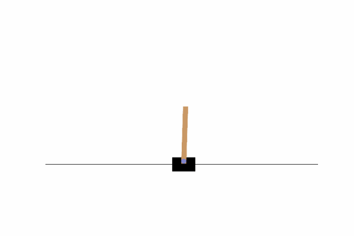

## This repo contains implementations of DRL algorithms

### If you want to start them locally:


### 1. Install poetry:

```
    pip install poetry 
```
### 2. Clone repo, enter to project and install env. dependencies with:

```
    poetry install
```

### Script try_model.py will show you smth like this
\

\
